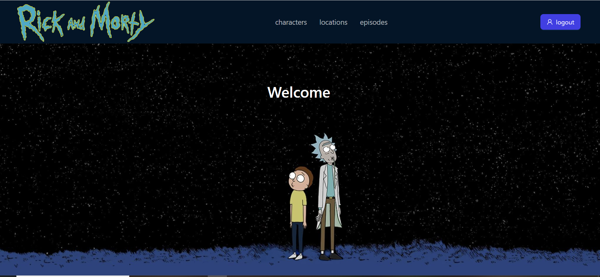
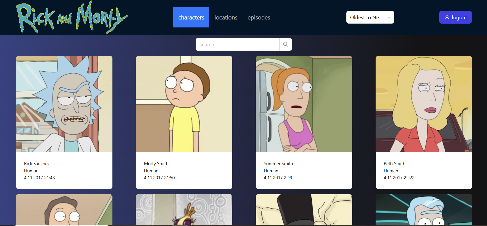

# Rick & Morty (учебный проект)

## Описание проекта
SPA-приложение по вселенной Rick & Morty с использованием современных React-практик. Проект разработан для углубленного изучения React и сопутствующих технологий.

## Ключевые особенности
- Полноценный PWA (возможность установки на устройство)
- Инфинити скролл с виртуализацией
- Ленивая загрузка компонентов
- Кастомные хуки для работы с API
- Контекст для управления состоянием
- Обработка ошибок через Error Boundary
- Адаптивный интерфейс

## Технологический стек

### Frontend
- **React 19** (хуки, lazy components)
- **Ant Design** (UI компоненты)
- **React Router v7** (навигация)
- **Axios** (HTTP-запросы)
- **Tailwind CSS** (стилизация)

### Оптимизации
- Код-сплиттинг
- Виртуализация списков
- Мемоизация компонентов
- PWA-конфигурация

## Функционал

### Пользовательский интерфейс
- Просмотр персонажей, эпизодов и локаций
- Детальные страницы для каждого элемента
- Поиск и сортировка по дате создания
- Адаптивный дизайн

## Установка и запуск

```bash
# Установка зависимостей
npm install

# Запуск dev-сервера
npm run dev

# Production сборка
npm run build
```
## Скриншоты интерфейса





